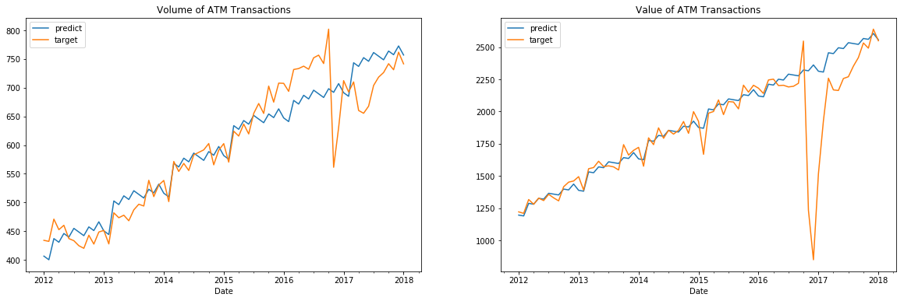
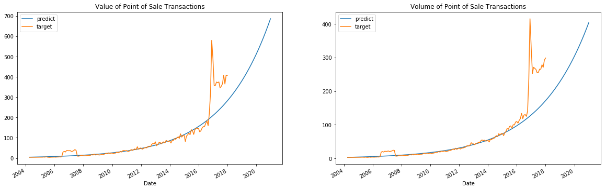

# Objective: Analysing the effects of Demonetisation on Digital Payments
# Data Source: RBI 

# ATM Cash Withdrawals (Value and Volume)

Blue line is a simulated scenario without demonetisation.

>We can see that demonetisation was just a transient event in the case of ATM transactions, the current cash withdrawals have already caught up with the Blue line.

# Point of Sale Transactions (Value and Volume)

POS transactions in the RBI data include debit cards, credit cards and mobile payments, it doesn't include cash 

Blue line is a simulated scenario without demonetisation.

>Digital payments in india were increasing exponentially before demonetisation.
>Even in the case of digital payments, demonetisation has created a transient change which is likely to catch up with the blue line.

    

